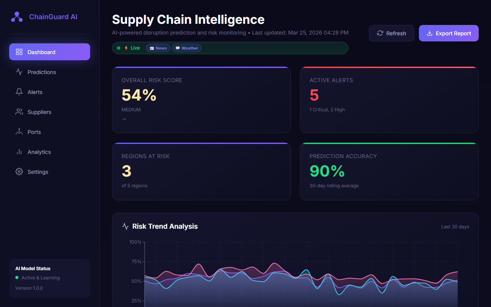
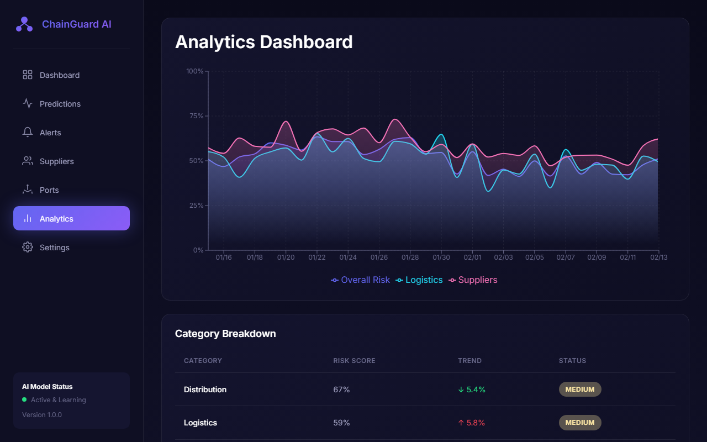
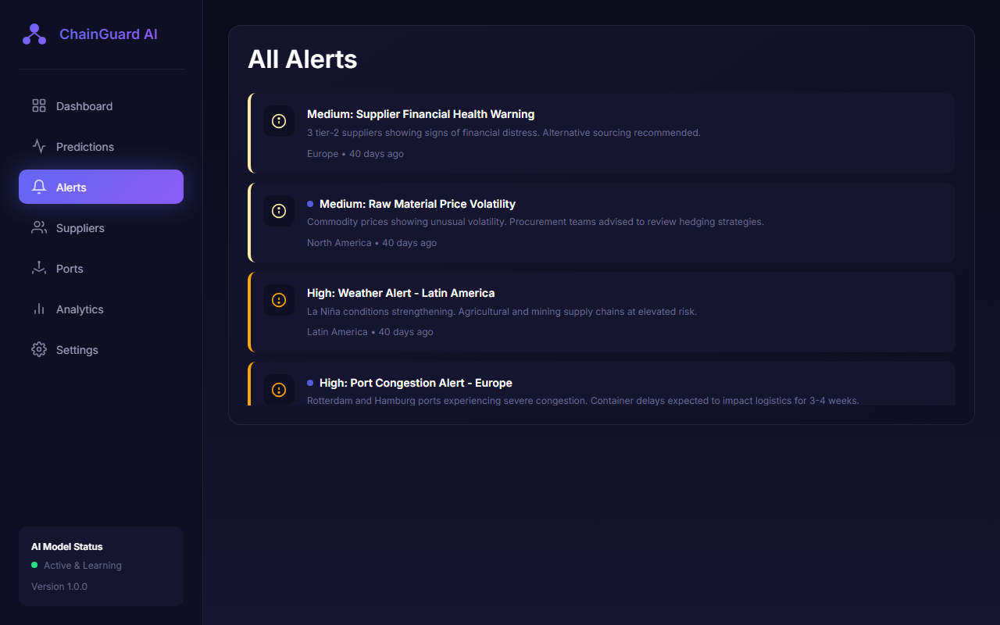
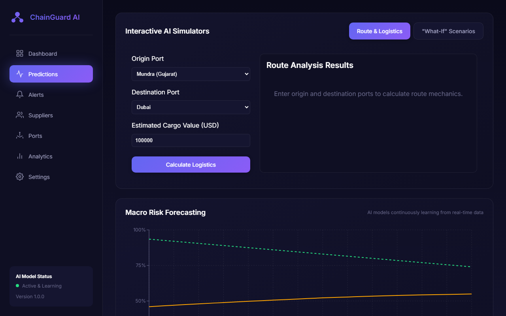

# 🔮 ChainGuard AI — Supply Chain Disruption Predictor

**Predict disruptions before they happen. Protect your supply chain.**


## Live Demo
🔗 [supply-chain-predictor-silk.vercel.app](https://supply-chain-predictor-silk.vercel.app)

## Screenshots

| Executive Dashboard | Regional Risk Map |
|---|---|
|  |  |

| Smart Alerts | AI Predictions |
|---|---|
|  |  |

## Overview
ChainGuard AI is an end-to-end risk intelligence platform for supply chain operations. It combines time-series forecasting, NLP-based news sentiment analysis, and real-time risk scoring to flag disruptions before they impact operations — built for teams in manufacturing, logistics, and procurement.

## Features
- 🤖 **AI-Powered Predictions** — Prophet time-series forecasting for disruption likelihood
- 📰 **Real-Time News Analysis** — NLP sentiment pipeline scoring supply chain news
- 🗺️ **Global Risk Mapping** — interactive regional risk visualization
- 🚨 **Smart Alerts** — proactive notifications before disruptions occur
- 📊 **Executive Dashboard** — dark-themed analytics UI, auto-refreshing every 30s
- 📈 **Trend Analysis** — historical and forecasted risk metrics

## Architecture

supply-chain-predictor/
├── backend/ # FastAPI Python Backend
│ ├── app/
│ │ ├── api/ # REST API endpoints
│ │ ├── core/ # Configuration
│ │ ├── ml/ # Machine learning models
│ │ ├── nlp/ # NLP pipeline
│ │ ├── models/ # Data schemas
│ │ └── services/ # Business logic
│ ├── main.py # Application entry
│ └── requirements.txt
├── frontend/ # React Vite Frontend
│ ├── src/
│ │ ├── components/ # UI components
│ │ ├── hooks/ # Custom React hooks
│ │ ├── services/ # API services
│ │ └── utils/ # Utilities
│ └── package.json
└── README.md


## Tech Stack
| Layer | Technology |
|---|---|
| Frontend | React 18, Vite, Recharts |
| Styling | Vanilla CSS with CSS Variables |
| Backend | FastAPI, Python 3.10+ |
| ML/AI | Prophet, scikit-learn, NLP pipeline |
| API | RESTful with auto-generated docs |
| Deployment | Vercel (frontend), Render (backend) |

## Quick Start

### Prerequisites
- Python 3.10+
- Node.js 18+
- npm or yarn

### Backend Setup
```bash
# Navigate to backend
cd backend

# Create virtual environment
python -m venv venv

# Activate (Windows)
venv\Scripts\activate

# Activate (Unix/macOS)
source venv/bin/activate

# Install dependencies
pip install -r requirements.txt

# Copy environment config
cp .env.example .env

# Run the server
python main.py
```

The API will be available at `http://localhost:8000`
- API Docs: `http://localhost:8000/docs`
- ReDoc: `http://localhost:8000/redoc`

### Frontend Setup
```bash
# Navigate to frontend
cd frontend

# Install dependencies
npm install

# Run development server
npm run dev
```

The dashboard will be available at `http://localhost:5173`

## API Endpoints
| Endpoint | Method | Description |
|---|---|---|
| `/api/dashboard/summary` | GET | Executive dashboard summary |
| `/api/dashboard/regions` | GET | Regional risk data |
| `/api/dashboard/alerts` | GET | Active alerts |
| `/api/dashboard/predictions` | GET | AI predictions |
| `/api/predictions/forecast` | GET | Risk forecast |
| `/api/predictions/analyze-text` | POST | NLP text analysis |
| `/api/predictions/risk-assessment` | GET | Comprehensive risk assessment |

## UI Features
- **Dark Theme** — premium dark color scheme with glassmorphism
- **Responsive Design** — works on desktop, tablet, and mobile
- **Real-Time Updates** — auto-refresh every 30 seconds
- **Interactive Charts** — Recharts-powered visualizations
- **Animated Map** — SVG world map with risk indicators

## Configuration
Create a `.env` file in the backend directory:
API Keys (optional - uses mock data if not provided)

NEWS_API_KEY=your_key_here
TWITTER_API_KEY=your_key_here

Risk Thresholds

RISK_THRESHOLD_HIGH=0.7
RISK_THRESHOLD_MEDIUM=0.4


## Use Cases
1. **Manufacturing** — predict production disruptions
2. **Logistics** — anticipate shipping delays
3. **Procurement** — assess supplier risks
4. **Finance** — forecast cost impacts
5. **Operations** — plan contingencies

## License
MIT License — see LICENSE file for details.

---

**Built with ❤️ for Supply Chain Resilience**

Reminder from earlier: I dropped LSTM, XGBoost, and Isolation Forest from the Tech Stack section since none of those appeared in the original README — only add them back once you've confirmed they're actually implemented in backend/app/ml/, so the repo and your resume stay consistent with each other.
